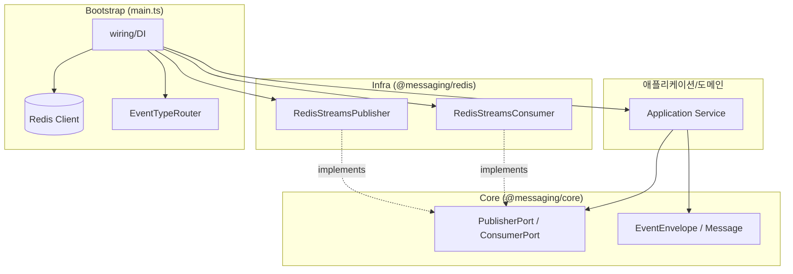
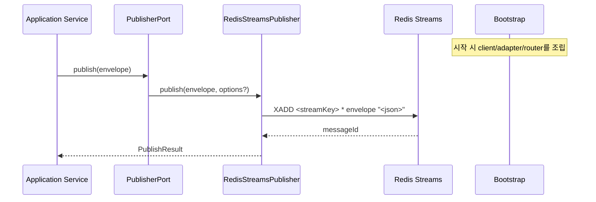
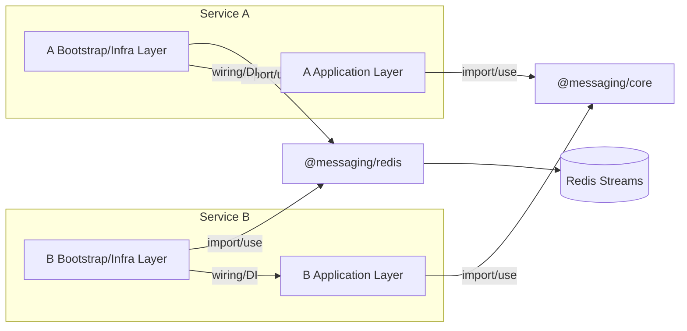
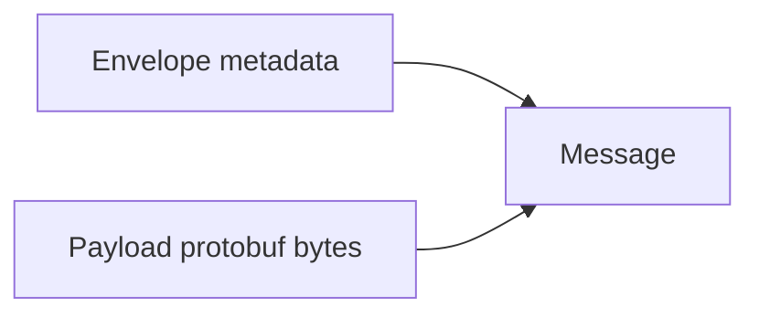

# @poomgo/messaging MVP 설계 문서 (Core + Redis 어댑터)

본 프로젝트는 `@poomgo/messaging`의 초석이 될 기능을 구현해보고 테스트 해보기 위한 프로젝트이다.

본 문서는 `@poomgo/messaging` MVP를 실제 구현 가능한 스펙으로 고정하기 위한 설계 문서다.


## 이번에 개발할 것 (MVP 구현 범위)

- Core 라이브러리 구현
- EventEnvelope/Message/PublishResult 타입 확정
- PublisherPort/ConsumerPort 인터페이스 확정
- Redis Streams 어댑터 구현 (`XADD`, `XREADGROUP`, `XACK`, `XGROUP CREATE`)
- EventType -> destination 기본 라우팅 + `publish(..., { destination })` override
- Auto-ack 기본 처리(`ackMode: autoOnSuccess`) 및 실패 시 no-ack
- 디코드 오류 기본 정책(`decodeErrorPolicy: ack`)
- 운영 점검 기준(PEL/XPENDING/XAUTOCLAIM), stop/drain, concurrency 문서화
- Protobuf 적용 방식(정적 코드 생성 + payload 바이너리) 설계 반영

MVP 제외:

- 공통 ConsumerRunner 프레임워크
- DLQ 자동 라우팅
- XAUTOCLAIM 자동 재처리 루프
- Kafka 어댑터 구현

## 목차

1. [0. 범위](#0-범위)
2. [1. 아키텍처 원칙](#1-아키텍처-원칙)
3. [2. 핵심 계약 (Core Contract)](#2-핵심-계약-core-contract)
4. [3. 직렬화 전략 (JSON + Protobuf)](#3-직렬화-전략-json--protobuf)
5. [4. Redis 어댑터 구현 스펙](#4-redis-어댑터-구현-스펙)
6. [5. 운영/장애 대응 가이드](#5-운영장애-대응-가이드)
7. [6. MVP 완료 기준 (Acceptance Criteria)](#6-mvp-완료-기준-acceptance-criteria)
8. [7. 향후 로드맵](#7-향후-로드맵)
9. [부록 A. 브로커 개념 매핑](#부록-a-브로커-개념-매핑)
10. [부록 B. 권장 폴더 구조](#부록-b-권장-폴더-구조)

------------------------------------------------------------------------

## 0. 범위

### 프로젝트 구조 방침

MVP 단계에서는 단일 프로젝트 안에서 `core`와 `adapters/redis`를 폴더 분리한다.

### 포함 (MVP)

- Core (`core/`)
  - EventEnvelope 표준
  - 공통 타입 / Port
- Redis 어댑터 (`adapters/redis/`)
  - Redis Streams 퍼블리셔 / 컨슈머
  - Consumer Group 기반 소비 + ack

### 제외 (향후)

- Kafka 어댑터
- 글로벌 재시도 / DLQ 정책 프레임워크
- 공통 ConsumerRunner

------------------------------------------------------------------------

# 1. 아키텍처 원칙

1. 애플리케이션 레이어는 `@messaging/core`에만 의존한다.
2. 어댑터(`@messaging/redis`)는 bootstrap/infra 레이어에서만 사용한다.
3. 전달 보장 수준은 at-least-once다.
4. 컨슈머 핸들러는 반드시 멱등성을 가져야 한다.

## 1-1. 정적 의존성 규칙



## 1-2. 런타임 흐름



## 1-3. Service A / Service B 레이어별 사용 위치



요약:

- Service A/B의 Application Layer는 `@messaging/core`만 사용
- Service A/B의 Bootstrap/Infra Layer에서만 `@messaging/redis` 사용
- 두 서비스 모두 동일한 레이어 규칙을 따른다

## 1-4. Import 규칙

```ts
// ✅ 애플리케이션 레이어
import type { EventPublisherPort, EventEnvelope } from "@messaging/core";
```

```ts
// ✅ bootstrap 레이어
import { RedisStreamsPublisher, RedisStreamsConsumer } from "@messaging/redis";
```

```ts
// ❌ 금지: 애플리케이션 서비스에서 어댑터 직접 import
import { RedisStreamsPublisher } from "@messaging/redis";
```

------------------------------------------------------------------------

# 2. 핵심 계약 (Core Contract)

## 2-1. EventEnvelope 표준

필수 필드:

- `eventId: string`
- `type: string`
- `occurredAt: string`
- `source: string`
- `schemaVersion: number`
- `payload: T`
- `headers?: Record<string, string>`

권장 헤더 키:

- `traceId`
- `correlationId`
- `tenantId`
- `partnerId`
- `dedupKey`

예시:

```json
{
  "eventId": "018f32c6-88d1-7f0e-bf4c-b8e5eafc37aa",
  "type": "order.created.v1",
  "occurredAt": "2026-03-04T10:12:45Z",
  "source": "oms-order-service",
  "schemaVersion": 1,
  "payload": {
    "orderId": 12345,
    "customerId": 777
  },
  "headers": {
    "traceId": "abc-123",
    "correlationId": "order-flow-001"
  }
}
```

## 2-2. Routing Contract

### 문제 정의

Redis Streams 기반 발행은 아래처럼 destination(=streamKey)이 필요하다.

```bash
XADD <streamKey> * envelope "<json>"
```

하지만 Core의 `publish(envelope)` 형태만으로는 `<streamKey>`를 직접 결정할 수 없다.
이 상태로 구현하면 애플리케이션이 `publisher.publish("orders", envelope)`처럼 broker 개념(stream/topic)을 알게 되어 Core 추상화가 깨진다.

### 해결 원칙

`destination`은 Core가 사용하는 라우팅 대상의 중립 표현이다.

- Kafka: `destination -> topic`
- Redis Streams: `destination -> streamKey` (Redis key)
- RabbitMQ: `destination -> exchange/queue` 조합
- SQS: `destination -> queue`

따라서 Core는 broker 개념(토픽/스트림/큐)을 직접 드러내지 않고 `destination`만 사용한다.
기본 라우팅은 `EventType(envelope.type) -> destination` 매핑으로 처리하고, 필요 시에만 `publish(..., { destination })`으로 override한다.

### 기본 라우팅 규칙 (권장)

- `envelope.type`을 key로 destination을 결정한다.
- 예: `"order.created.v1" -> "orders"`

```ts
type Destination = string;

interface EventTypeRouter {
  /** eventType(envelope.type)로 destination을 결정한다. */
  resolve(eventType: string): Destination;
}

const defaultRouter: EventTypeRouter = {
  resolve: (eventType) => {
    // 예시: 접두사 기반, 혹은 맵 기반으로 구현
    // return routingTable[eventType] ?? "unknown";
    return eventType.split(".")[0]; // (예시) order.created.v1 -> "order"
  },
};
```

MVP에서는 맵 기반 라우팅 테이블(명시적 매핑)을 가장 권장한다.
이 구조는 Redis에서 Kafka로 이행해도 동일하게 유지된다.

### 최종 destination 결정 순서

1. `options.destination`이 있으면 사용
2. 없으면 `router.resolve(envelope.type)` 결과를 사용

이 규칙에 따라 `PublishResult.destination`은 최종 결정된 destination을 반환한다.

## 2-3. PublisherPort

역할:

- 브로커에 이벤트를 발행한다.
- 라우팅 결과(destination)를 호출자에게 투명하게 반환한다.
- 발행 결과(messageId)를 추적 가능하게 제공한다.

설계 포인트:

- 애플리케이션은 브로커 용어(topic/stream)를 몰라야 한다.
- 따라서 `publish(envelope, options?)`만 제공하고, 목적지는 `destination`으로 추상화한다.

```ts
interface PublishOptions {
  /**
   * (선택) 발행 목적지. 지정하면 router 결과보다 우선한다.
   * 예: 재처리/운영성 목적의 임시 stream 지정
   */
  destination?: string;
}

interface PublishResult {
  /** broker가 반환한 메시지 식별자 (Redis stream ID 등) */
  messageId: string;
  /** 최종 라우팅된 destination */
  destination: string;
}

interface EventPublisherPort {
  publish<T>(envelope: EventEnvelope<T>, options?: PublishOptions): Promise<PublishResult>;
}
```

## 2-4. ConsumerPort

역할:

- 이벤트를 읽고 핸들러로 전달한다.
- 처리 성공/실패를 ACK 규칙으로 반영한다.
- at-least-once 전달 모델에서 운영적으로 안전한 기본값을 제공한다.

권장 기본 모드 (MVP):

- `ackMode: autoOnSuccess`
- 성공 시 consumer가 자동 ack
- 실패 시 ack 금지(no-ack)

이유:

- 실무에서 가장 흔한 장애는 “성공했지만 ack 누락”이다.
- 기본값을 auto-ack로 두면 이 장애를 구조적으로 줄일 수 있다.

```ts
interface ConsumerOptions {
  /** 기본값: autoOnSuccess */
  ackMode?: "autoOnSuccess" | "manual";
  /** manual 모드에서 ack 누락 시 처리 정책 */
  onAckMissing?: "warn" | "error" | "autoAck";
  concurrency?: number; // MVP 기본값 1
}
```

Ack 규칙:

- 성공 -> ACK
- 실패 -> no-ACK

미ACK 메시지는 Redis PEL(Pending Entries List)에 남는다.

권장 핸들러 형태:

```ts
// 기본 모드(autoOnSuccess)
type AutoAckHandler<T> = (message: Message<T>) => Promise<void>;

// 고급 모드(manual)
type ManualAckHandler<T> = (message: Message<T>, ack: () => Promise<void>) => Promise<void>;
```

------------------------------------------------------------------------

# 3. 직렬화 전략 (JSON + Protobuf)

## 3-1. 기본 직렬화 (MVP 기본)

- Envelope는 JSON 문자열 직렬화
- 필드명 camelCase 유지
- `occurredAt`은 발행 시 필수

권장 규칙:

- `safeJsonStringify`를 사용해 직렬화 예외를 명시적으로 처리
- 순환 참조 payload는 금지
- `schemaVersion`은 producer가 항상 채운다

## 3-2. Protobuf 적용 방향

적용 옵션:

- 런타임 동적 로딩(`protobufjs`)
- 정적 코드 생성(`ts-proto`, `@bufbuild/protobuf`, `google-protobuf`)

선택:

- MVP/운영 관점에서 정적 코드 생성 채택
- 스키마 관리: Buf
- 코드 생성: ts-proto

선택 이유:

- 타입 안정성이 높아 producer/consumer 계약 깨짐을 빌드 타임에 탐지 가능
- 런타임 reflection 비용이 줄어 성능/예측 가능성이 높음
- CI에서 `buf breaking`으로 하위 호환성 관리 가능

파이프라인:

- `proto -> buf lint/breaking -> ts-proto -> generated TypeScript`

## 3-3. Envelope vs Payload 분리

- Envelope: 추적/라우팅/관찰성용 메타데이터
- Payload: 도메인 데이터, protobuf bytes 직렬화



## 3-4. Redis 저장 권장 구조

원칙:

- 사람이 자주 확인하는 메타는 문자열 필드로 저장
- 대용량/엄격 스키마 데이터는 `payload_bin` 바이너리로 저장

```bash
XADD orders * \
  eventId "uuid" \
  type "order.created.v1" \
  occurredAt "2026-03-05T..." \
  source "oms-order-service" \
  schemaVersion "1" \
  payload_bin <bytes>
```

장점:

- Redis CLI에서 메타 조회가 쉬움
- payload는 compact + 스키마 일관성 유지
- broker 교체 시에도 Envelope 계약은 그대로 유지 가능

------------------------------------------------------------------------

# 4. Redis 어댑터 구현 스펙

## 4-1. RedisPublisher

발행:

```bash
XADD <streamKey> * envelope "<json>"
```

`streamKey` 결정:

1. `publish(..., { destination })`
2. `router.resolve(envelope.type)`

반환:

- Redis Stream ID -> `PublishResult.messageId`

예시:

```bash
XADD orders * envelope "{...json...}"
```

실패 처리 원칙:

- Redis 오류는 호출자에게 예외로 전파한다.
- 호출자는 재시도/보상 트랜잭션을 결정한다.

## 4-2. RedisConsumer

필수 설정:

- `streamKey`
- `group`
- `consumer`
- `blockMs` (기본 2000)
- `count` (기본 10)

소비:

```bash
XREADGROUP GROUP <group> <consumer>
BLOCK <blockMs>
COUNT <count>
STREAMS <streamKey> >
```

성공 시 ack:

```bash
XACK <streamKey> <group> <id>
```

처리 흐름:

1. 메시지 읽기 (`XREADGROUP`)
2. `envelope` 필드 추출/파싱
3. 핸들러 실행
4. 성공 시 ACK, 실패 시 no-ACK

운영 주의:

- no-ACK 메시지는 재처리 대상이므로 멱등성 전제가 필수다.
- `blockMs`/`count`는 처리량과 지연의 균형값으로 조정한다.

## 4-3. Consumer Group 초기화

```bash
XGROUP CREATE <streamKey> <group> $ MKSTREAM
```

`BUSYGROUP`(이미 존재) 오류는 무시.

초기화 시점:

- bootstrap 시작 시 1회 수행
- 멀티 인스턴스 환경에서는 동시 생성 경쟁이 발생할 수 있으므로 BUSYGROUP 무시가 정상

## 4-4. stop() 의미 (Drain/Immediate)

권장 기본:

- `graceful + drain`
- 신규 read 중단 후 in-flight 처리 완료 대기

옵션:

- `drainTimeoutMs` 이후 강제 중단 가능

권장 동작:

1. 신규 read 중단
2. in-flight 처리 종료 대기
3. timeout 시 강제 종료 또는 경고 로그

## 4-5. 동시성(concurrency)

MVP 기본값:

- `concurrency = 1` (직렬)

옵션 병렬 처리 시 규칙:

- 메시지별 성공/실패 판단과 ack를 독립 처리
- stop(drain) 시 모든 in-flight 슬롯 비워질 때까지 대기
- 순서가 중요한 도메인은 `concurrency=1` 유지

추가 가이드:

- `concurrency > 1`이면 완료 순서가 입력 순서와 달라질 수 있다.
- 동일 aggregate(예: orderId) 순서 보장이 필요하면 스트림 분리 또는 샤딩 전략을 사용한다.

------------------------------------------------------------------------

# 5. 운영/장애 대응 가이드

## 5-1. PEL 이해

`XREADGROUP`로 읽은 뒤 ACK하지 않은 메시지는 PEL에 남는다.

PEL 잔류 의미:

- 처리 중
- 핸들러 실패
- ack 누락 버그
- consumer crash

점검/재처리 명령:

```bash
XPENDING <streamKey> <group> - + 100
XAUTOCLAIM <streamKey> <group> <consumer> 60000 0-0 COUNT 10
```

해석 기준:

- PEL 증가가 지속되면 handler 실패율/ack 누락/consumer 장애를 우선 점검한다.
- idle 시간이 긴 pending은 크래시/정지된 consumer 소유일 가능성이 높다.

## 5-2. 디코드 오류 정책

MVP 기본:

- decode 실패 시 오류 로그
- `decodeErrorPolicy: ack`로 ACK 처리(독성 메시지 적체 방지)

권장 로그 필드:

- `messageId`, `streamKey`, `group`, `consumer`
- 원본 payload 일부(민감정보 제외), 예외 타입, 스키마 버전

향후:

- DLQ 라우팅
- 세분화된 디코드 정책

## 5-3. 에러 시나리오 매트릭스

| 시나리오 | Ack 여부 | 메시지 상태 | 운영자 조치 |
|---|---|---|---|
| 핸들러 성공 | 예 | PEL 제거 | 없음 |
| 핸들러 실패 | 아니오 | PEL 잔류 | `XPENDING`/`XAUTOCLAIM` 점검 |
| decode 오류(ack) | 예 | PEL 제거 | 스키마/producer 점검 |
| 컨슈머 크래시(ack 전) | 아니오 | PEL 잔류 | 수동 reclaim |
| Redis 네트워크 오류 | - | 미소비/재시도 | 연결 상태 점검 |

## 5-4. 모니터링 권장

주요 지표:

- stream 길이
- group lag
- PEL 크기
- handler 실패율
- 처리 지연(latency)

알림 권장 임계치(초기값 예시):

- PEL > 1000 지속 5분
- handler 실패율 > 1% (5분 이동 평균)
- consumer lag 급증(평시 대비 3배 이상)

권장 로그 필드:

- `eventId`, `messageId`, `type`, `destination`
- `group`, `consumer`
- `traceId`, `correlationId`

## 5-5. Retention/Trimming 정책

옵션:

- 길이 기반: `MAXLEN`
- 시간 기반: `MINID`

원칙:

- PEL에 남은 메시지까지 제거되지 않도록 안전한 기준 사용
- 운영 알림으로 트림 과도/지연 감지

MVP 권장:

- 초기는 길이 기반(`MAXLEN ~`)으로 단순 시작
- 소비 안정화 후 시간 기반(`MINID`) 병행 검토

------------------------------------------------------------------------

# 6. MVP 완료 기준 (Acceptance Criteria)

## 6-1. Core

- EventEnvelope/Message/PublishResult 타입 고정
- PublisherPort/ConsumerPort 인터페이스 고정
- 라우팅 계약(`destination`) 반영

검증 조건:

- 애플리케이션 레이어에서 adapter import가 없어야 함
- `publish(envelope)` 호출만으로 발행 가능해야 함

## 6-2. Redis Adapter

- XADD 발행 성공
- XREADGROUP 소비 + XACK 처리 성공
- Consumer Group 자동 생성
- decode 오류 기본 정책 동작
- stop(drain) 기본 동작 검증

검증 조건:

- BUSYGROUP 경쟁 상황에서도 기동 성공
- `options.destination` override 시 지정 stream으로 발행

## 6-3. 테스트/검증

- 중복 전달(at-least-once) 시 멱등성 처리 검증
- ack 누락/실패 시 PEL 잔류 확인
- 컨슈머 크래시 후 pending 메시지 재처리 절차 검증
- concurrency=1 기본 처리 흐름 검증

권장 테스트 유형:

- 단위 테스트: 라우터/직렬화/ack 분기
- 통합 테스트: Redis 실환경 명령(XADD/XREADGROUP/XACK) 검증
- 장애 주입 테스트: ack 전 프로세스 종료 시나리오

------------------------------------------------------------------------

# 7. 향후 로드맵

1. XAUTOCLAIM 자동 재처리 루프
2. DLQ 지원
3. ConsumerRunner(재시도/백오프/동시성 오케스트레이션)
4. Kafka 어댑터 추가
5. 고급 직렬화/스키마 정책 강화

우선순위 제안:

- 1순위: 자동 재처리 루프(XAUTOCLAIM) + 관측 지표 고도화
- 2순위: DLQ 및 재처리 운영 도구
- 3순위: Kafka 어댑터 및 멀티 브로커 표준화

------------------------------------------------------------------------

# 부록 A. 브로커 개념 매핑

- Kafka `topic` <-> Core `destination`
- Redis `streamKey` <-> Core `destination`
- RabbitMQ `exchange/queue` <-> Core `destination`
- SQS `queue` <-> Core `destination`

Core는 broker별 용어 대신 `destination`만 표준 개념으로 유지한다.

------------------------------------------------------------------------

# 부록 B. 권장 폴더 구조

```text
messaging/
├── core/
│   ├── types/
│   │   ├── envelope.ts
│   │   └── message.ts
│   ├── ports/
│   │   ├── publisher.ts
│   │   └── consumer.ts
│   └── index.ts
├── adapters/
│   └── redis/
│       ├── redisPublisher.ts
│       ├── redisConsumer.ts
│       ├── types.ts
│       └── index.ts
├── package.json
├── tsconfig.json
└── README.md
```
