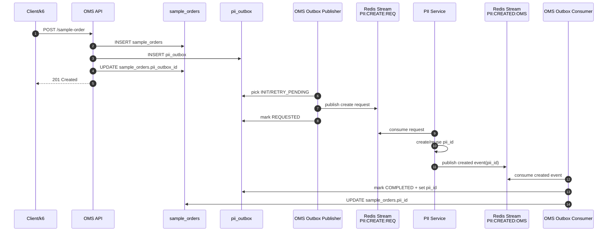
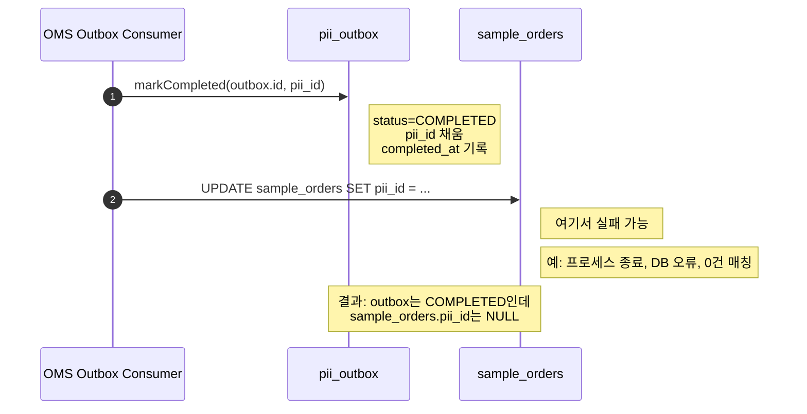
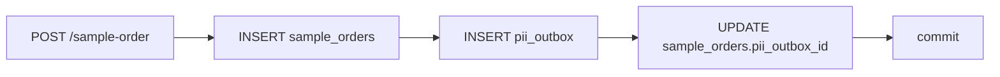
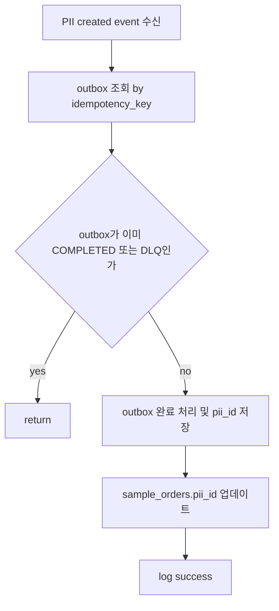
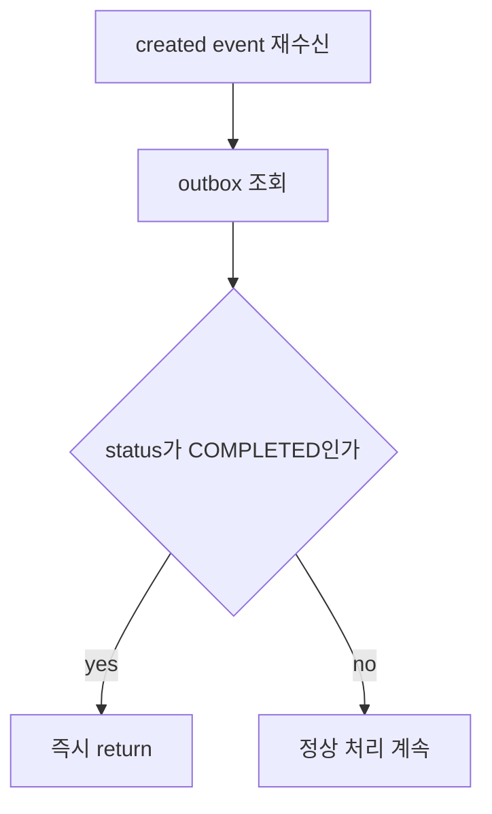
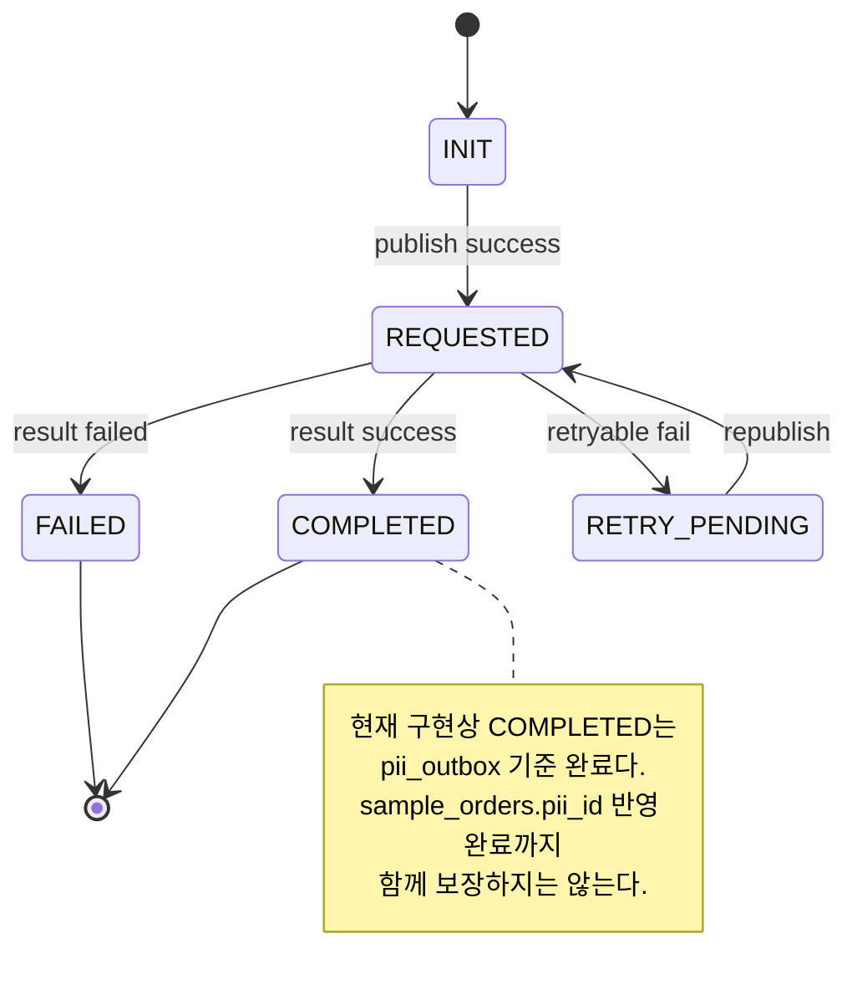
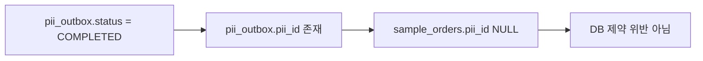
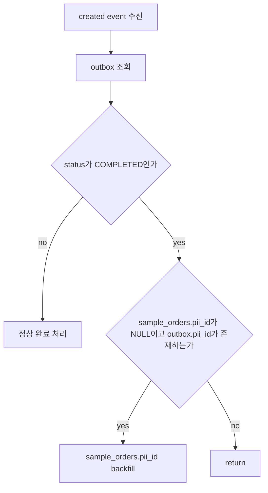

# sample_orders.pii_id / pii_outbox.pii_id 불일치 이슈 정리

작성일: 2026-03-10

대상 서비스:
- `poomgo_oms_backend`
- `poomgo_pii`

관련 구현:
- `poomgo_oms_backend/src/sample-order/sample-order.service.ts`
- `poomgo_oms_backend/src/pii-outbox/schedule/pii-outbox.publisher.ts`
- `poomgo_oms_backend/src/pii-outbox/stream/pii-outbox.consumer.ts`
- `poomgo_oms_backend/src/pii-outbox/pii-outbox.service.ts`

---

## 1. 문제 정의

부하테스트 중 아래 상태가 관측되었다.

- `sample_orders.pii_id IS NULL`
- 같은 row가 참조하는 `pii_outbox.pii_id IS NOT NULL`
- `pii_outbox.status = COMPLETED`

즉, PII 처리 자체는 완료되었지만 최종 참조 반영이 `sample_orders`까지 일관되게 전파되지 않은 row가 존재한다.

대표 확인 쿼리:

```sql
select
  so.sample_order_id,
  so.order_no,
  so.pii_id as sample_pii_id,
  so.pii_outbox_id,
  po.pii_id as outbox_pii_id,
  po.status,
  po.completed_at,
  po.updated_at
from sample_orders so
join pii_outbox po on po.id = so.pii_outbox_id
where so.pii_id is null
  and po.pii_id is not null
order by so.sample_order_id desc;
```

---

## 2. 한 줄 결론

현재 구현은 `pii_outbox` 완료 처리와 `sample_orders.pii_id` 반영이 같은 트랜잭션으로 묶여 있지 않다.
따라서 중간 실패가 나면 `pii_outbox`만 완료되고 `sample_orders`는 NULL로 남을 수 있다.

또한 재수신 시 `outbox.status === COMPLETED`이면 consumer가 바로 종료하므로, 일부 누락 건은 자동 복구되지 않을 수 있다.

---

## 3. 정상 흐름



정상이라면 최종 상태는 아래와 같다.

- `pii_outbox.status = COMPLETED`
- `pii_outbox.pii_id IS NOT NULL`
- `sample_orders.pii_id = pii_outbox.pii_id`

---

## 4. 실제로 깨지는 흐름



핵심은 순서가 아래처럼 분리되어 있다는 점이다.

1. `pii_outbox` 완료 처리
2. `sample_orders` 반영

이 둘 사이에 원자성이 없다.

---

## 5. 현재 코드 기준 상세 원인

### 5.1 생성 시점

`sample_order` 생성 시 `sample_orders`와 `pii_outbox`는 같은 트랜잭션 안에서 생성되며, `sample_orders.pii_outbox_id`도 저장된다.



즉, 생성 단계 자체는 비교적 일관적이다.

### 5.2 완료 반영 시점

문제는 결과 소비 단계다.

현재 consumer는 대략 아래 순서로 동작한다.



이 구조에서는 `D` 성공 후 `E` 실패가 가능하다.

---

## 6. 왜 자동 복구가 안 될 수 있는가



즉, 한 번이라도 `pii_outbox`가 `COMPLETED`로 바뀌면 이후 같은 결과 이벤트가 다시 와도 `sample_orders.pii_id` backfill이 실행되지 않을 수 있다.

따라서 이 이슈는 단순한 "일시적 지연"이 아니라, 일부 row는 영구적으로 어긋난 상태로 남을 수 있는 구조다.

---

## 7. 상태 관점 다이어그램



즉, 현재 FSM의 완료 의미와 실제 비즈니스 완료 의미가 다르다.

- 현재 FSM 완료 의미: `pii_outbox` row 완료
- 실제 비즈니스 완료 의미: `sample_orders.pii_id`까지 반영 완료

---

## 8. 데이터 정합성 관점의 문제

현재 스키마 제약은 아래 수준이다.

- `sample_orders.pii_id`는 NULL 허용
- `sample_orders.pii_outbox_id`는 NULL 허용
- `pii_outbox`는 `COMPLETED`면 자기 row 안에서만 `pii_id`, `completed_at` non-null 보장

즉, 아래 불일치를 DB가 막아주지 않는다.



그래서 애플리케이션 레벨에서 반드시 보정이 필요하다.

---

## 9. 탐지 쿼리

### 9.1 불일치 건 조회

```sql
select
  so.sample_order_id,
  so.order_no,
  so.pii_id as sample_pii_id,
  so.pii_outbox_id,
  po.pii_id as outbox_pii_id,
  po.status,
  po.request_count,
  po.last_error,
  po.completed_at,
  so.updated_at as sample_updated_at,
  po.updated_at as outbox_updated_at
from sample_orders so
left join pii_outbox po on po.id = so.pii_outbox_id
where so.pii_id is null
order by so.sample_order_id desc;
```

### 9.2 강한 불일치만 조회

```sql
select
  so.sample_order_id,
  so.order_no,
  so.pii_outbox_id,
  po.pii_id,
  po.status,
  po.completed_at
from sample_orders so
join pii_outbox po on po.id = so.pii_outbox_id
where so.pii_id is null
  and po.status = 'COMPLETED'
  and po.pii_id is not null
order by so.sample_order_id desc;
```

---

## 10. 임시 복구 SQL

```sql
update sample_orders so
set pii_id = po.pii_id,
    updated_at = now()
from pii_outbox po
where so.pii_outbox_id = po.id
  and so.pii_id is null
  and po.pii_id is not null;
```

주의:
- 운영 적용 전 범위를 반드시 확인해야 한다.
- `sample_orders`는 DEV/LOCAL 성격이 강하지만, 동일 패턴이 다른 source table에도 있으면 같은 방식으로 누락될 수 있다.

---

## 11. 권장 수정 방향

아래 1차, 2차 수정은 현재 코드에 반영되었다.

- `PiiOutboxConsumer.handleCreated()`에 `@Transactional()` 적용
- `COMPLETED` 상태에서도 `sample_orders.pii_id` 누락 시 backfill 허용

관련 구현:

- `poomgo_oms_backend/src/pii-outbox/stream/pii-outbox.consumer.ts`
- `poomgo_oms_backend/src/pii-outbox/stream/pii-outbox.consumer.spec.ts`

### 11.1 1차 수정: 원자성 확보

`handleCreated()`에 `@Transactional()`을 적용해 아래 두 작업이 같은 DB 트랜잭션 안에서 처리되도록 한다.

- `piiOutboxService.markCompleted()`
- `sampleOrderModel.update({ piiId })`

```mermaid
flowchart TD
  A[created event 수신] --> B[@Transactional handleCreated 진입]
  B --> C[pii_outbox를 COMPLETED로 갱신]
  C --> D[sample_orders.pii_id 갱신]
  D --> E[성공 시 commit]
  D --> F[실패 시 rollback]
```

이렇게 해야 둘 중 하나만 반영되는 상태를 막을 수 있다.

### 11.2 2차 수정: idempotent backfill 허용

`outbox.status === COMPLETED`여도 아래 조건이면 다시 `sample_orders.pii_id`를 채우도록 허용한다.

- `outbox.pii_id IS NOT NULL`
- 연결된 source row의 `pii_id IS NULL`



### 11.3 3차 수정: 완료 의미 재정의

선택지는 두 가지다.

1. 현재 구조 유지
   - `pii_outbox.COMPLETED`는 outbox 자체 완료로 둔다
   - 대신 source row backfill을 별도 보정 로직으로 보장한다

2. 의미 강화
   - `sample_orders.pii_id` 반영까지 끝나야 `COMPLETED`
   - 즉 consumer 안에서 source 반영 성공 후에만 `markCompleted()`

현재 구현은 1차 + 2차까지 반영된 상태다.
완료 의미 재정의는 추가 판단이 필요한 별도 선택사항이다.

---

## 12. 운영/테스트 해석상 의미

이 이슈가 있으면 `GET /sample-order/:id`나 부하테스트 polling은 아래처럼 왜곡될 수 있다.

- `outboxStatus.status == COMPLETED`
- 하지만 `body.piiId == null`

즉, "비동기 처리는 끝났는데 조회 결과는 미완료처럼 보이는" 상태가 생긴다.

그래서 load test에서 E2E 완료 기준을 아래 둘 중 하나로 볼 때 차이가 생긴다.

- 느슨한 기준: `outboxStatus.status == COMPLETED`
- 엄격한 기준: `sample_orders.pii_id IS NOT NULL`

현재 비즈니스적으로는 후자가 더 맞다.

---

## 13. 최종 정리

이 이슈의 본질은 단순 backlog가 아니라 정합성 갭이다.

- `pii_outbox` 완료와 `sample_orders` 반영이 분리돼 있다.
- 완료 이벤트 재수신 시에도 누락 row가 자동 복구되지 않을 수 있다.
- 그래서 `pii_outbox.pii_id`가 있는데 `sample_orders.pii_id`가 NULL인 row가 남을 수 있다.

따라서 우선순위는 아래 순서가 적절하다.

1. `handleCreated()`를 트랜잭션화
2. `COMPLETED` 상태에서도 source row backfill 허용
3. 불일치 탐지/보정 SQL 또는 배치 추가
4. E2E 성공 정의를 `sample_orders.pii_id` 기준으로 재검토
