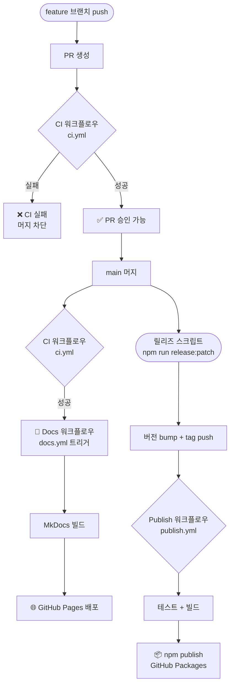
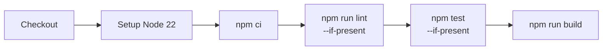
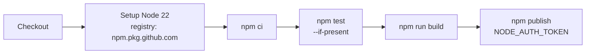
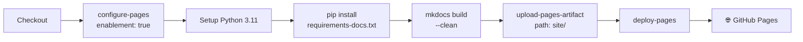
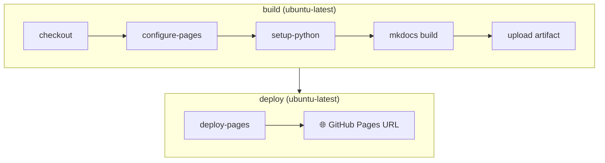

# CI/CD 파이프라인

이 프로젝트는 세 가지 GitHub Actions 워크플로우로 자동화되어 있습니다.

---

## 전체 흐름



---

## 워크플로우 1 — CI (`ci.yml`)

**파일:** `.github/workflows/ci.yml`

### 트리거

| 이벤트 | 조건 |
|---|---|
| `pull_request` | 모든 브랜치 |
| `push` | `main` 브랜치만 |

### 단계



| 단계 | 명령어 | 설명 |
|---|---|---|
| 1 | `actions/checkout@v6` | 소스 체크아웃 |
| 2 | `actions/setup-node@v6` | Node.js 22 세팅 |
| 3 | `npm ci` | 의존성 설치 (lock 파일 기준) |
| 4 | `npm run lint --if-present` | 린트 (설정 시 실행) |
| 5 | `npm test --if-present` | Jest 테스트 |
| 6 | `npm run build` | tsup으로 CJS+ESM+타입선언 빌드 |

### Concurrency 설정

```yaml
concurrency:
  group: ci-${{ github.ref }}
  cancel-in-progress: true
```

동일 브랜치/PR의 이전 실행을 자동으로 취소합니다.

---

## 워크플로우 2 — Publish Package (`publish.yml`)

**파일:** `.github/workflows/publish.yml`

### 트리거

```
push: tags: "v*"
```

`release.sh` 스크립트가 `v1.2.3` 형태의 태그를 push할 때 자동으로 실행됩니다.

### 단계



| 단계 | 명령어 | 설명 |
|---|---|---|
| 1 | `actions/checkout@v6` | 소스 체크아웃 |
| 2 | `actions/setup-node@v6` | `registry-url: https://npm.pkg.github.com` |
| 3 | `npm ci` | 의존성 설치 |
| 4 | `npm test --if-present` | 테스트 재확인 |
| 5 | `npm run build` | 배포용 빌드 |
| 6 | `npm publish` | GitHub Packages에 publish |

### 권한 및 인증

```yaml
permissions:
  contents: read
  packages: write  # GitHub Packages 쓰기

env:
  NODE_AUTH_TOKEN: ${{ secrets.GITHUB_TOKEN }}  # 자동 주입
```

`GITHUB_TOKEN`은 별도 설정 없이 Actions에서 자동 제공됩니다.

### 게시 대상

- **Registry:** `https://npm.pkg.github.com`
- **Scope:** `@shhan-ops`
- **패키지명:** `@shhan-ops/event-messaging`

---

## 워크플로우 3 — Deploy Docs (`docs.yml`)

**파일:** `.github/workflows/docs.yml`

### 트리거

| 이벤트 | 조건 |
|---|---|
| `workflow_run` | `CI` 워크플로우 완료 + `main` 브랜치 + `success` |
| `workflow_dispatch` | 수동 실행 |

### 단계



### 빌드 vs 배포 Job 분리



배포 환경은 `github-pages`로 설정되어 있어, 배포 URL이 Job Summary에 출력됩니다.

### 자동 배포 조건

```yaml
if: ${{ github.event_name == 'workflow_dispatch' ||
        github.event.workflow_run.conclusion == 'success' }}
```

`main`의 CI가 실패하면 Docs도 배포되지 않습니다.

---

## GitHub Pages 설정

GitHub Pages를 처음 활성화하려면 Repository 설정이 필요합니다.

```
Repository → Settings → Pages
  Source: GitHub Actions  ← 반드시 이 옵션
```

!!! warning "Source 설정 주의"
    `Deploy from a branch`가 아닌 **`GitHub Actions`** 를 선택해야 합니다.

---

## 로컬 사전 검증

PR 올리기 전 아래 명령어로 확인합니다.

=== "테스트 + 빌드"

    ```bash
    npm test
    npm run build
    ```

=== "문서 로컬 미리보기"

    ```bash
    pip install -r requirements-docs.txt
    mkdocs serve
    # → http://127.0.0.1:8000
    ```

=== "문서 빌드만"

    ```bash
    mkdocs build --clean
    # → site/ 디렉토리 생성
    ```

---

## 관련 문서

- [릴리즈 정책 & 스크립트 배포](release-policy.md)
- [Redis 운영 Runbook](redis-runbook.md)
