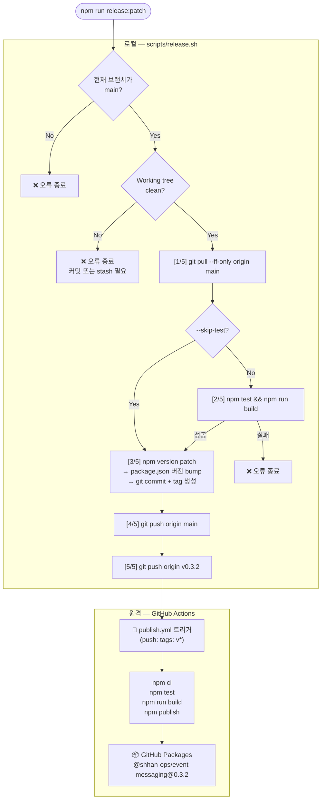
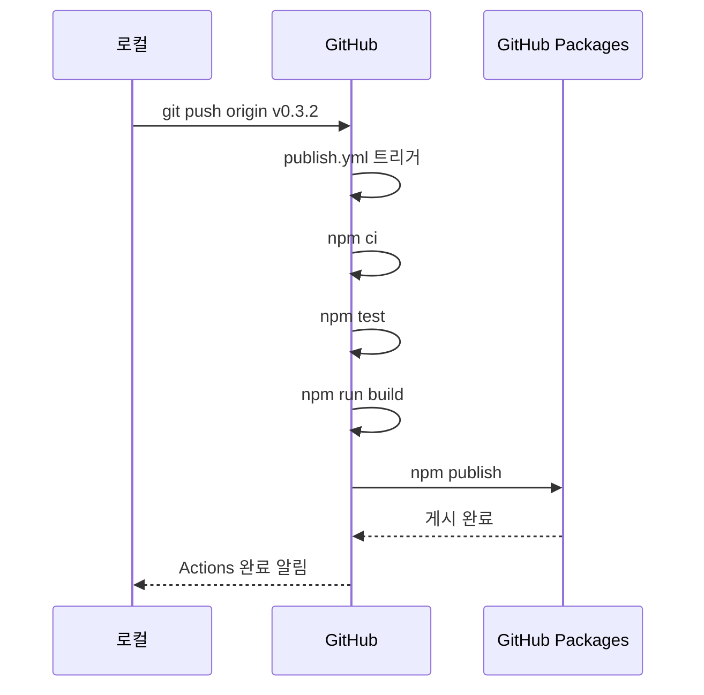
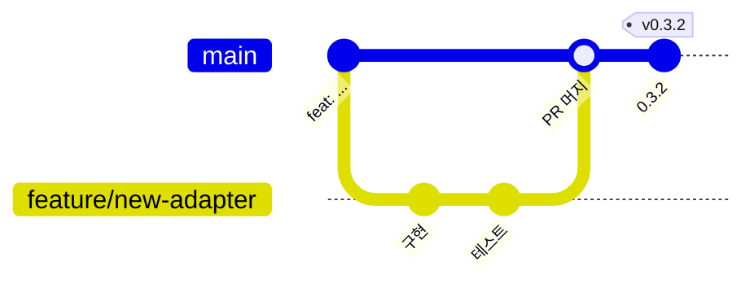
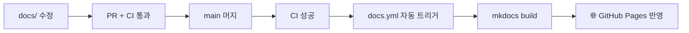

# 릴리즈 정책 & 스크립트 배포

---

## 버전 정책 (SemVer)

`@shhan-ops/event-messaging`은 [Semantic Versioning](https://semver.org/lang/ko/)을 따릅니다.

| 타입 | 변경 유형 | 예시 |
|---|---|---|
| `MAJOR` | Breaking change — 하위 호환 불가 | API 인터페이스 제거/변경 |
| `MINOR` | Backward-compatible feature 추가 | 새 어댑터 또는 옵션 추가 |
| `PATCH` | Bug fix | 기존 동작 수정 |

---

## 스크립트 배포 (`release.sh`)

**파일:** `scripts/release.sh`

로컬에서 아래 명령어로 실행합니다.

```bash
npm run release:patch   # 0.3.1 → 0.3.2
npm run release:minor   # 0.3.1 → 0.4.0
npm run release:major   # 0.3.1 → 1.0.0

# 직접 버전 지정
npm run release 1.2.3

# 테스트 스킵 (긴급 패치 시)
./scripts/release.sh patch --skip-test
```

---

## 스크립트 배포 흐름



---

## 단계별 상세 설명

### 사전 검증

```bash
# main 브랜치 확인
CURRENT_BRANCH=$(git rev-parse --abbrev-ref HEAD)
# → "main" 이 아니면 즉시 종료

# working tree clean 확인
git diff --quiet && git diff --cached --quiet
# → 미커밋 변경사항 있으면 즉시 종료
```

!!! danger "주의"
    `main` 브랜치에서만 실행 가능합니다. feature 브랜치에서 실행 시 오류로 종료됩니다.

### [1/5] 원격 동기화

```bash
git pull --ff-only origin main
```

Fast-forward만 허용합니다. 로컬이 원격보다 앞선 커밋이 있으면 실패합니다.

### [2/5] 테스트 & 빌드

```bash
npm test && npm run build
```

- `--skip-test` 옵션으로 스킵 가능 (긴급 패치 시만 사용)
- 테스트 또는 빌드 실패 시 버전 bump를 진행하지 않습니다

### [3/5] 버전 bump

```bash
npm version patch   # 또는 minor / major / x.y.z
```

`npm version`이 내부적으로 수행하는 동작:

```
1. package.json 버전 필드 수정
2. git add package.json
3. git commit -m "0.3.2"
4. git tag v0.3.2
```

버전 커밋과 태그가 로컬에 생성됩니다.

### [4/5] main 브랜치 push

```bash
git push origin main
```

버전 bump 커밋을 원격에 반영합니다. CI 워크플로우가 트리거됩니다.

### [5/5] 태그 push

```bash
git push origin v0.3.2
```

이 태그 push가 `publish.yml` 워크플로우를 트리거합니다.

---

## GitHub Actions 배포 (publish.yml)

태그 push 이후 자동으로 실행됩니다.



---

## 브랜치 & 배포 정책



- 기본 브랜치: `main`
- 패키지 publish 트리거: `v*` 태그 push
- **GitHub Actions(`publish.yml`)를 통한 배포만 허용** (로컬 `npm publish` 금지)

---

## 문서 배포 정책

문서는 코드와 동일한 PR 프로세스를 거칩니다.



- `main` 반영 즉시 GitHub Pages 자동 배포
- 로컬 미리보기: `mkdocs serve`

---

## 자주 쓰는 명령어 요약

```bash
# 릴리즈 (main 브랜치, clean working tree 필요)
npm run release:patch
npm run release:minor
npm run release:major

# 빌드
npm run build

# 테스트
npm test

# 문서 로컬 서버
mkdocs serve

# 문서 빌드
mkdocs build --clean
```

---

## 관련 문서

- [CI/CD 파이프라인](ci-cd.md)
- [Redis 운영 Runbook](redis-runbook.md)
